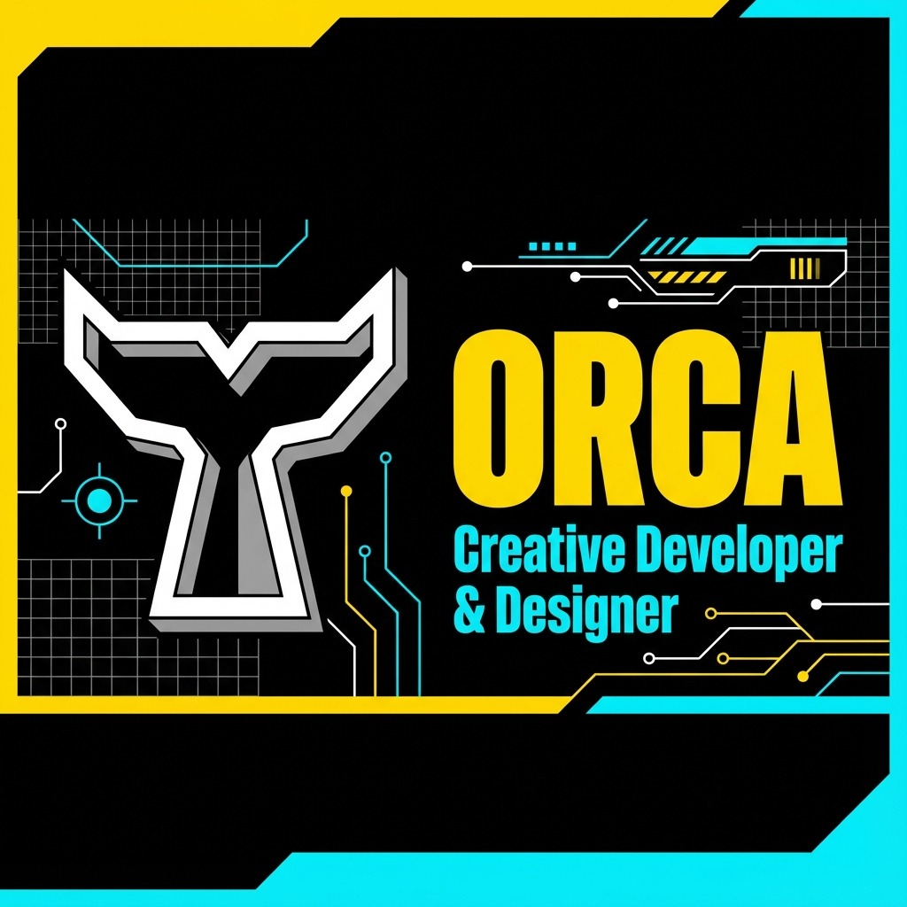

<div align="center">

<!-- Animated Header -->


<!-- Animated Typing -->
<a href="#">
  
</a>

<br/><br/>

<!-- Badges -->
[](https://github.com/skibi-akhil)
[](https://developer.mozilla.org/en-US/docs/Web/HTML)
[](https://developer.mozilla.org/en-US/docs/Web/CSS)
[](https://developer.mozilla.org/en-US/docs/Web/JavaScript)

</div>

---

## 🌊 About

**ORCA** is a stunning, modern portfolio website built with a beautiful **Neumorphic Dark Theme**. It features smooth animations, responsive design, and a professional cyan color palette that makes your work stand out.

<div align="center">
  
</div>

---

## ✨ Features

<table>
<tr>
<td width="50%">

### 🎨 Design
- **Neumorphic Dark Theme** with soft shadows
- **Light/Dark Mode Toggle** with smooth transitions
- Professional **cyan accent color** (#00E5FF)
- Animated **LOADING preloader**
- Glowing **scroll progress indicator**

</td>
<td width="50%">

### ⚡ Performance
- **Pure HTML, CSS & JavaScript** - No frameworks
- **Lightweight** and fast loading
- **Responsive** design for all devices
- **SEO optimized** with meta tags
- **Social media cards** for sharing

</td>
</tr>
</table>

---

## 🚀 Quick Start

```bash
# Clone the repository
git clone https://github.com/skibi-akhil/orca.git

# Navigate to the project
cd orca

# Open in browser
start !DOCTYPE.html   # Windows
open !DOCTYPE.html    # macOS
xdg-open !DOCTYPE.html # Linux
```

---

## 📁 Project Structure

```
orca/
├── !DOCTYPE.html      # Main HTML file (all-in-one)
├── orca-logo.png      # Cyan orca logo icon
├── favicon.png        # Browser favicon
├── og-image.png       # Social media preview card
└── README.md          # This file
```

---

## 🎯 Sections

| Section | Description |
|---------|-------------|
| 🏠 **Hero** | Eye-catching introduction with social links |
| 👤 **About** | Skills showcase - Design, Development, Strategy |
| 💼 **Projects** | Portfolio grid with project cards |
| 📧 **Contact** | Contact form with social media buttons |

---

## 🌈 Color Palette

<div align="center">

| Color | Hex | Usage |
|-------|-----|-------|
| 🔵 **Cyan** | `#00E5FF` | Primary accent, highlights |
| 🟡 **Yellow** | `#FFD600` | Secondary accent |
| 🩷 **Pink** | `#FF4081` | Active states |
| 🟢 **Olive** | `#C6FF00` | Success states |
| ⬛ **Dark BG** | `#1a1a1a` | Background |
| ⬜ **Light BG** | `#f0f8ff` | Light theme background |

</div>

---

## 📱 Responsive Design

<div align="center">

| Device | Breakpoint | Optimized |
|--------|------------|-----------|
| 📱 Mobile | < 768px | ✅ |
| 📱 Tablet | 768px - 1024px | ✅ |
| 💻 Desktop | > 1024px | ✅ |

</div>

---

## 🛠️ Technologies

<div align="center">


</div>

---

## 👨‍💻 Author

<div align="center">
  <a href="https://github.com/skibi-akhil">
    
  </a>
  <a href="https://www.linkedin.com/in/akhil-sibi-ba784a367">
    
  </a>
  <a href="https://www.instagram.com/akhil.siby">
    
  </a>
</div>

---

## 📄 License

This project is open source and available under the [MIT License](LICENSE).

---

<div align="center">

<!-- Animated Footer -->


**Made with 💙 by Akhil Sibi**

<a href="#top">
  
</a>

</div>
